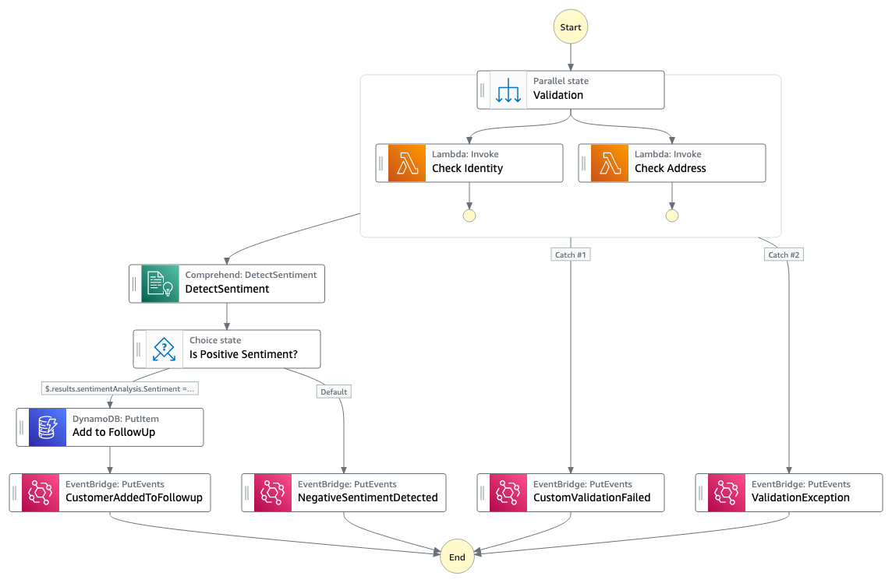

# Step Functions Local Testing using JUnit and Spock
This project contains information about the [sample test application](https://github.com/aws-samples/aws-stepfunctions-examples/tree/main/sam/demo-local-testing-using-java) that highlights use of JUnit and Spock test framework to test Step functions locally.

## Workflow Under Test
The system under test in this pattern is a Step Functions Workflow with multiple service integrations to AWS Lambda, Amazon Comprehend, and Amazon DynamoDB.

## Goal
This pattern demonstrates how to use mock service integrations to test Step Functions Workflows when using Step Functions Local. 
The pattern enables developers to define sample outputs from AWS service integrations. 
The mocked responses can be combined into test case scenarios to validate workflow control and data flow definitions. 
This pattern is intended to perform rapid functional testing without affecting cloud resources. 
Testing is conducted in a self-contained local environment. 
This pattern enables rapid development and testing of a Step Functions Workflow that makes calls to other AWS cloud services using service integrations. 
This pattern eliminates the need to perform a build and deploy of the Step Functions Workflow to the cloud between modifications of the workflow definition. 
This pattern eliminates the need to access cloud resources to conduct tests.

## Description
The [blog contains an example Step Functions Workflow](https://aws.amazon.com/blogs/compute/mocking-service-integrations-with-aws-step-functions-local/) which orchestrates a sales lead tracker that integrates with AWS Lambda, Amazon Comprehend, Amazon DynamoDB, and Amazon EventBridge. 
The test suite defines mocked responses for the service integrations in the [mock configuration file](https://docs.aws.amazon.com/step-functions/latest/dg/sfn-local-test-sm-exec.html). 
A mock configuration file can have multiple test cases to test happy path and negative scenarios. 
Developers should create an adequate amount of test cases using mocked service integrations to thoroughly test their workflow prior to deploying the workflow to the cloud. 
Developers should test their workflows in the cloud for thorough IAM and downstream load testing.

## How to test
The [sample application](https://github.com/aws-samples/aws-stepfunctions-examples/tree/main/sam/demo-local-testing-using-java) covers the test code written using JUnit and Spock.