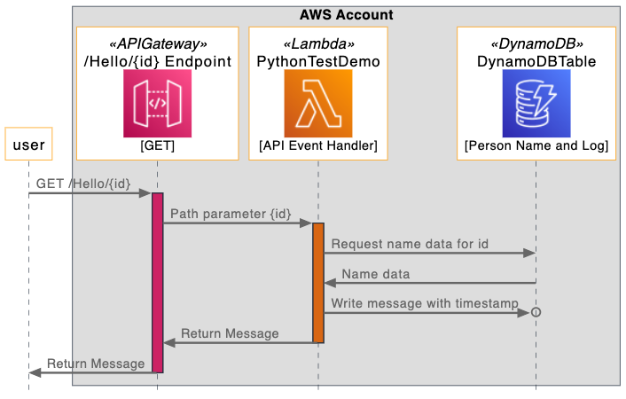

# Python: Amazon Api Gateway, AWS Lambda, Amazon DynamoDB Example

This project contains automated test sample code samples for serverless applications written in Python. The project demonstrates several techniques for executing tests including mocking, emulation and testing in the cloud specifically when interacting with the Amazon DynamoDB service. Based on current tooling, we recommend customers **focus on testing in the cloud** as much as possible. 

## Project contents
The project uses the [AWS Serverless Application Model](https://docs.aws.amazon.com/serverless-application-model/latest/developerguide/what-is-sam.html) (SAM) CLI for configuration, testing and deployment. 

- [Python: Amazon Api Gateway, AWS Lambda, Amazon DynamoDB Example](#python-amazon-api-gateway-aws-lambda-amazon-dynamodb-example)
  - [Project contents](#project-contents)
  - [Sample project description](#sample-project-description)
  - [Testing Considerations](#testing-considerations)

## Sample project description

The sample project allows a user to call an API endpoint generate a custom "hello" message, and also tracks the messages it generates.  I user provides an "id", which the endpoint uses to look up the person's name associated with that id, and generates a message.  The message is recorded in DynamoDB and also returned to the caller:

This project consists of an [API Gateway](https://aws.amazon.com/api-gateway/), a single [AWS Lambda](https://aws.amazon.com/lambda) function, and a [Amazon DynamoDB](https://aws.amazon.com/dynamodb) table.

The DynamoDB Table is a [single-table design](https://aws.amazon.com/blogs/compute/creating-a-single-table-design-with-amazon-dynamodb/), and both the name lookup and the message tracking use the same table. The table schema is as follows:
* For all records, the "Partition Key" is the id.
* For name records, the "Sort Key" is set to a constant = "NAME#"
* For message history records, the "Sort Key" is set to "TS#" appended with the current date-time stamp.
* The payloads are in a field named "data".

## Testing Considerations

When testing the functionality an application with a data store, there are considerations that arise for testing as a result data persistence.  

To test certain functionality, the data store must be pre-populated with data.  In our example, we need a valid name to retrieve to test our function.  Therefore, we will add data to the data stores prior to runing the tests.  

Another consideration is the data store will be populated as a side-effect of our testing.  In our example, items of recorded "Hello" messages will be populated in our DynamoDB table.  To prevent unintended side-effects, we will clean-up data generated during the test execution.

