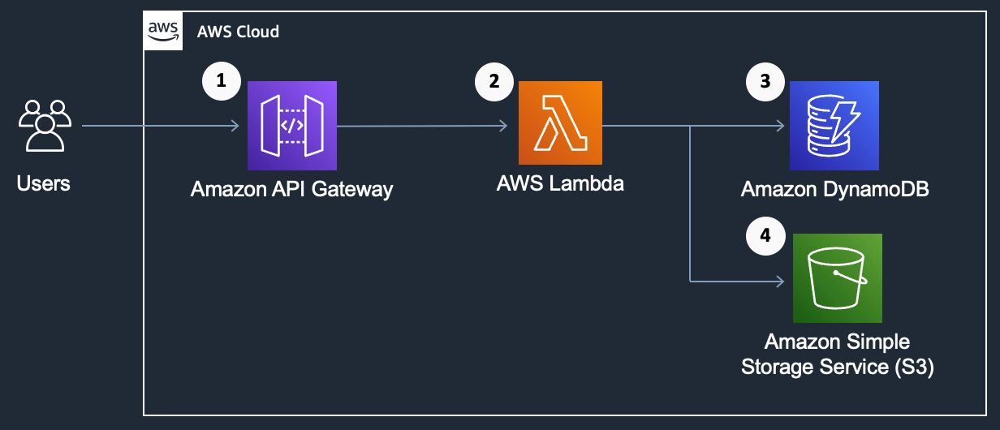

[](https://img.shields.io/badge/Python-3.9-green)
[](https://img.shields.io/badge/AWS-DynamoDB-blueviolet)
[](https://img.shields.io/badge/AWS-AWS-S3-green)
[](https://img.shields.io/badge/Test-Unit-blue)

# Test AWS Lambda function handlers locally using mocks (Python)

## Introduction

The project consists of an Amazon API Gateway, an AWS Lambda function, a DynamoDB Table, and an S3 bucket.  Although this project can be deployed, the focus of the code is to demonstrate local unit testing approaches using Python and mocking.  This project demonstrates testing locally an AWS Lambda function handler replacing remote API calls with mocks.  The Lambda function has optimizations for cold starts with global initializations, which are accomodated in the unit test.  

---

## Contents
- [Test AWS Lambda function handlers locally using mocks (Python)](#test-aws-lambda-function-handlers-locally-using-mocks-python)
  - [Introduction](#introduction)
  - [Contents](#contents)
  - [System Under Test (SUT)](#system-under-test-sut)
  - [Goal](#goal)
  - [Description](#description)
  - [Sample Project](#sample-project)
  - [Key Files in the Project](#key-files-in-the-project)
  - [Prerequisites](#prerequisites)
  - [Make commands for test and deployment](#make-commands-for-test-and-deployment)
  - [Running the project](#running-the-project)
  - [License](#license)
---

## System Under Test (SUT)

The SUT in this pattern is a Lambda function that makes calls to other AWS cloud services using an AWS SDK.


[Top](#contents)

---

## Goal

This pattern is intended to enable rapid development and testing of a Lambda function that makes calls to other AWS services. Testing occurs on a local desktop environment and does not affect cloud resources. This pattern speeds development by eliminating the need to perform a build and deploy of the Lambda function to the cloud between modifications of test or function code.  This pattern eliminates the need to access cloud resources to conduct tests. Mock tests are also useful for testing failure conditions within your code, especially when mocking third party services beyond your control.

[Top](#contents)

---

## Description

In this pattern, you develop a Lambda function that makes calls to other AWS cloud services using an AWS SDK.  The test first sets up mocked versions of the AWS services accessed by the Lambda function.  Your tests then invoke the handler function on your local desktop, passing a synthetic event as a parameter. During the test the calls to external cloud services are handled instead by the mocked objects, returning the pre-configured results set up by the test code. 

This pattern can be used with a variety of infrastructure as code systems including SAM, Serverless Framework, CDK, CloudFormation and Terraform. This pattern uses a simple test framework, with the test harness directly calling the Lambda function handlers.  No cloud resources or full ** stack emulation are required.


[Top](#contents)

---

## Sample Project

For this example, we demonstrate a system that generates a document, written to Amazon S3, based on contents from a key-value lookup in DynamoDB.



An API Gatway path [1] triggers an AWS Lambda function [2] that retrieves a data from a DynamoDB [3] table and writes data to a object on Amazon S3 [4].  The API path contains a Document Type and a Customer ID.  The Lambda function retrieves both the Document Type data and Customer ID data and combines them, writing the data to S3 and returning the object key [1].  The DynamoDB table name and the S3 bucket name are provided to the Lambda function via environment variables.  

The DynamoDB table schema is comprised of a Partition Key (PK) for looking up a given item, and a “data” field containing string contents.  Document Type Items are prefixed with D#, and Customer items have a PK prefixed with C#.

[Top](#contents)

---

## Key Files in the Project
  - [app.py](src/sample_lambda/app.py) - Lambda handler code to test
  - [test_sample_lambda.py](tests/unit/src/test_sample_lambda.py) - Unit test using mocks
  - [template.yaml](template.yaml) - SAM script for deployment
  - [Makefile](Makefile) - Commands for setup, test, and deployment
  

> The code in this project is simplified - we’ve opted for concise snippets over fully completed or PEP8 compliant production code.

[Top](#contents)

---
## Prerequisites

* [AWS CLI](https://docs.aws.amazon.com/cli/latest/userguide/getting-started-install.html)
* [AWS Serverless Application Model (SAM) CLI](https://docs.aws.amazon.com/serverless-application-model/latest/developerguide/serverless-sam-cli-install.html)
* [Python 3.9](https://www.python.org/downloads/)
* [Make build utility](https://www.gnu.org/software/make/)

[Top](#contents)

---

## Make commands for test and deployment

The project Makefile contains helper commands for working with the project:
* ```make install```: Create a Python Virtual Envionment and install dependencies
* ```make test```: Run a unit test, guarding for socket connections
* ```make coverage```: Run unit tests and provide a coverage report
* ```make deploy```: Deploy the stack to an AWS Account
* ```make deploy.g```: Deploy the stack to an AWS Account, prompting for stack parameters

[Top](#contents)

---

## Running the project

* First, create the Python Virtual Environment by using the ```make createEnv``` command.
* Run the unit tests with the ```make unittest``` command.
* To deploy the project, deploy the project using the ```make deploy.guided``` command.
* Once deployed, locate the DynamoDB Table created and add two records:
  * ```{ "PK" : "C#TestCustomer", "data" : "Testing Customer"}```
  * ```{ "PK" : "D#Welcome", "data" : "\nHello and Welcome!\n"}```
* As authentication is not configured, you can test the endpoint using the API Gateway service in the AWs Console:
*  ```https://{region}.console.aws.amazon.com/apigateway```  

[Top](#contents)

---

## License

Copyright Amazon.com, Inc. or its affiliates. All Rights Reserved.

Permission is hereby granted, free of charge, to any person obtaining a copy of this
software and associated documentation files (the "Software"), to deal in the Software
without restriction, including without limitation the rights to use, copy, modify,
merge, publish, distribute, sublicense, and/or sell copies of the Software, and to
permit persons to whom the Software is furnished to do so.

THE SOFTWARE IS PROVIDED "AS IS", WITHOUT WARRANTY OF ANY KIND, EXPRESS OR IMPLIED,
INCLUDING BUT NOT LIMITED TO THE WARRANTIES OF MERCHANTABILITY, FITNESS FOR A
PARTICULAR PURPOSE AND NONINFRINGEMENT. IN NO EVENT SHALL THE AUTHORS OR COPYRIGHT
HOLDERS BE LIABLE FOR ANY CLAIM, DAMAGES OR OTHER LIABILITY, WHETHER IN AN ACTION
OF CONTRACT, TORT OR OTHERWISE, ARISING FROM, OUT OF OR IN CONNECTION WITH THE
SOFTWARE OR THE USE OR OTHER DEALINGS IN THE SOFTWARE.

[Top](#contents)